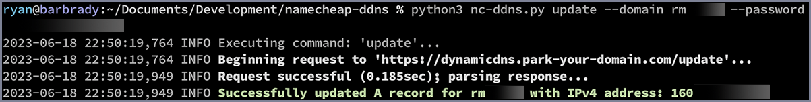

# namecheap-ddns

A simple, lightweight Python script for updating [Namecheap Dynamic DNS](https://www.namecheap.com/support/knowledgebase/subcategory/11/dynamic-dns) records. You don’t even need to know your public IP address.

`nc-ddns.py` was designed with cron and similar scheduled/event-triggered system daemons in mind. It can just as easily be run manually whenever you like–but that’s not really ideal. We invented computers to do work for us.

## Installation

Well, first, you’re going to need [Python](https://www.python.org/). According to [vermin](https://pypi.org/project/vermin/), a tool that tests for minimum version support, you will likely need version ≥ 3.7.

### Dependencies

I am quite sure all or nearly all of the modules imported are already packaged with Python in its `/Lib`.  [requests](https://requests.readthedocs.io/en/latest/user/quickstart/)  and [urllib3](https://urllib3.readthedocs.io/en/stable/user-guide.html) may be exceptions to that rule. Any missing modules can be installed by running `pip install <package>`.

Other than installing dependencies, all that’s left to do is move `nc-ddns.py` to the location you’d like (or symlink it).

## Usage

The command-line interface is relatively simple; it is divided into sub-commands, of which there are currently two. The  full command-line takes this form:

`python3 nc-ddns.py [top-level-arguments] <command> [command-specific-arguments]`

### Top-level arguments

There are two ‘top-level’ arguments that must come before any others:

|   Argument   | Description                                                  |
| :----------------: | :----------------------------------------------------------- |
|  `--debug`          | Enables detailed diagnostic output to the terminal. Use only if you are experiencing problems, or out of sheer morbid curiosity. |
| `-h/--help` | Displays the usage information for the entire script and all available commands. |

### Commands

|   Command   | Description                                                  | Arguments                                                    |
| :---------: | :----------------------------------------------------------- | :----------------------------------------------------------- |
| **update**  | Perform a web transaction with Namecheap’s servers and ensure that your domain’s A record is up-to-date. | `-d/--domain` <u>domain</u> The TLD (top-level domain) that you would like to update the record for. It is important to note that this is a *case-sensistive* argument. You must enter it in the same case as it appears in your Namecheap account.  `-p/--password` <u>pw</u> Your Namecheap DDNS password. This is *not* the same as your account login password. Instructions for [locating your DDNS password](#locating-your-ddns-password) are further down the page.  `-i/--ip` <u>addr</u> *(optional)* If you would prefer supplying the address yourself, use this flag. IPv4 addresses only.  `-r/--retry` <u>num</u> *(optional)* The maximum number of times to retry the transaction if an error is encountered that is retryable. This flag is considered **on** by default if omitted and has the value `15`. See [Error Conditions](#error-conditions) for specifics.  `-n/--no-retry` *(optional)* Disables retries. If any errors are encountered, the script will simply display an error and exit.  `-h/--help` Displays a message containing this information. |
| **resolve** | Utilize a third-party web service to determine your public IPv4 address and display it. | Takes the same `-r/--retry` and `-n/--no-retry` arguments as the **update** command, plus:  `-s/--service` <u>svc</u> *(optional)* If you wish to override the default IP address resolution service, use this flag and set the value to the service’s API endpoint URL. Note: currently, the script only parses plaintext IPv4 addresses as a response, so only services who comply with that will work *(unless you want to add parsing code yourself)*. |

### Examples

Update the Dynamic DNS record for a domain named ‘myclosetserver.io’ with the minimal amount of optional configuration, and allow Namecheap to determine the correct address based on your client connection (*obviously, that isn’t going to work if you’re on a VPN* watching Japanese Anime on Netflix):

`python3 nc-ddns.py update --domain myclosetserver.io --password AN839FNN813308300GBG`

**Here’s what the output looks like for me with my own domain:**

### Error Conditions

The following describes in technical detail what categories and severity of error the script may encounter while trying to perform a web transaction, and which of them are currently tagged “retryable.”

It is worth mentioning that under most retryable error scenarios, there is an exponential “backoff” algorithm applied. All this means is that if it fails once, it will try again rather quickly, but if it fails again, it will wait longer–approximately twice as long as the previous interval. Without doing this, it would in all probability just fail *max* times in a few milliseconds and exit with an error.

Sometimes, the server tells you how long to wait before retrying your request. In that circumstance, there is not an exponential backoff applied.

#### Categories of Errors

1. DNS resolution failure: it is possible for your computer to be unable to resolve the address of a given server for a period of time. Name resolution failures are always retryable.
2. TCP/IP connection failure: servers can become overloaded, be down for maintenance, run out of resources, etc. Your own network and the entire chain of devices between you and a server can be responsible for this kind of error. Connection failures are always retryable.
3. HTTP-level errors: there are a surprising number of HTTP error response codes, and it is difficult to make a perfect list of which ones are not likely to be resolved any time soon. That being said, the following codes are retryable as of now (I intend to add to this list; it is not complete yet in my opinion):
	 | HTTP Code | Description of Cause |
   | :-------: | -------------------- |
   |    408    | Request Timeout      |
   |    413    | Payload Too Large    |
   |    429    | Too Many Requests    |
   |    502    | Bad Gateway          |
   |    503    | Service Unavailable  |
   |    504    | Gateway Timeout      |

To summarize, the script will do its best to succeed every time it is executed, but sometimes it *will* fail, so if you deploy it as part of an automated flow, make sure that you configure it to handle the case where it fails (the process exits with a non-zero status code).

## Locating Your DDNS Password

1. Sign in to [Namecheap](https://namecheap.com) and navigate to your *Domain List* from the *Account* menu.
2. Locate the domain, and click the *Manage* button on the right end.
3. Click the *Advanced DNS* tab towards the top of the page.
4. Scroll down until you reach *Dynamic DNS*. You should see something like this:
    
    
    Don’t worry if you see a message that says “*No Records Found*” in the list below this area; if you scroll up the page further,
    
    you’ll find an A record with your current *(last set)* IP address. If you like, you can hit the button next to the password to refresh and get a new password.

## Questions and Comments

I welcome <u>any and all</u> feedback. Feel free to [write me](mailto://lederman@gmail.com) or open a [new issue](https://github.com/aremmell/namecheap-ddns/issues/new/choose) in the project.

## TODO List

The following is my task list for future releases. If you have any ideas, shoot them over to me and I’ll get them in the list too.

* [ ] Utilize https://httpstat.us/ and similar services to find more HTTP codes that can be successfully recovered from given enough time.
* [ ] Write unit and regression tests
* [ ] Add a command-line argument:
  * [ ] To choose a file on disk to log to in addition (or instead of) to the terminal.
  * [ ] To specify a command that should be run if the script fails (e.g., it could send you an email)
* [ ] Obfuscate passwords in the logger, particularly if log files are ever used.
* [ ] Add instructions to this document to set up a reocurring execution of the script on Windows, macOS and Linux.
* [ ] Add an option to securely store an encrypted version of the password (paired with a domain), so that it’s not necessary to find it and paste it in the terminal every time you run the script manually.

------

Copyright &copy; 2023 Ryan M. Lederman, All Rights Reserved.
